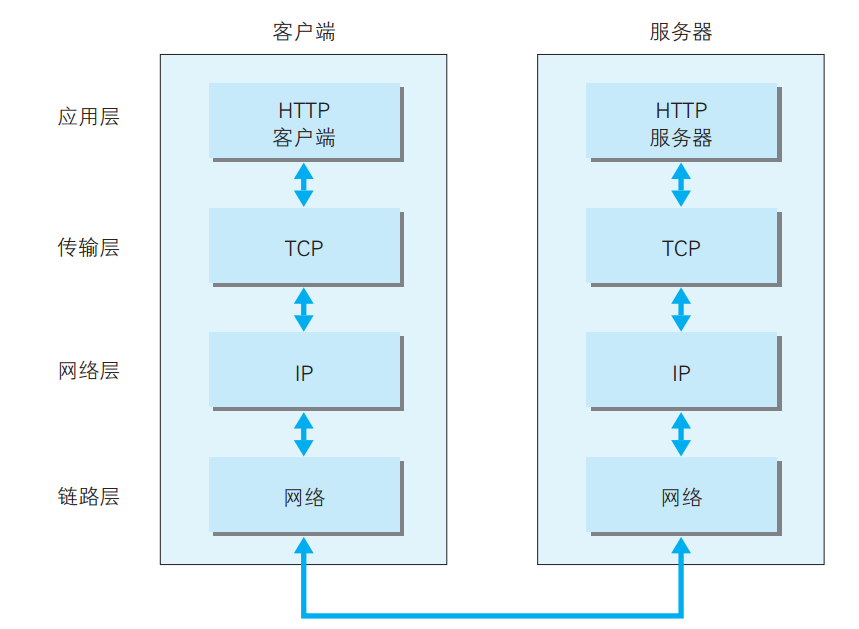
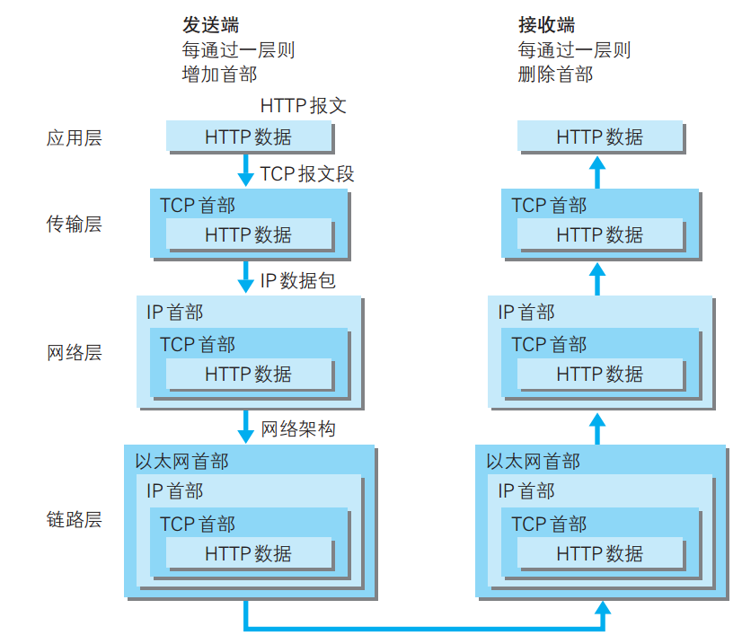
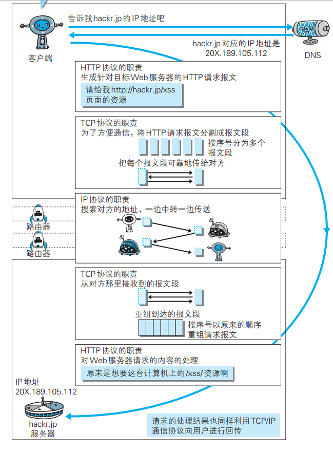
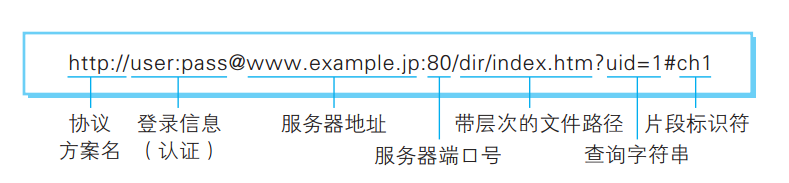

## 第 1 章 使用 HTTP 协议访问 Web(p1~p20)

HTTP 的全称 HyperText Transfer Protocol. 诞生于 1989 年 3 月.
WWW(World Wide Web)3 项技术:

-   把 SGML(Standard Generalized Markup Language)作为页面的文本标记语言的 HTML
-   作为文档传输协议的 HTTP
-   指定文档所在地的 URL(Uniform Resource Locator)

[HTML 1.0](https://www.w3.org/MarkUp/draft-ietf-iiir-html-01.txt)

1994 年 12 月, 网景发布 Netscape Navigator 1.0, 1995 年微软发布 Internet Explorer 1.0 和 2.0.
Apache 发布 Apache 0.2, HTML 也发布 2.0 版本.

[HTTP 1.0](https://www.ietf.org/rfc/rfc1945.txt) 1996 年 5 月

[HTTP 1.1](https://www.ietf.org/rfc/rfc2616.txt) 1997 年 1 月

[HTTP 2.0](https://tools.ietf.org/html/rfc7540) 2015 年 5 月

用于判断是否使用了 http2 的脚本

```js
;(function() {
    // 保证这个方法只在支持loadTimes的chrome浏览器下执行
    if (window.chrome && typeof chrome.loadTimes === 'function') {
        var loadTimes = window.chrome.loadTimes()
        var spdy = loadTimes.wasFetchedViaSpdy
        var info = loadTimes.npnNegotiatedProtocol || loadTimes.connectionInfo
        // 就以 「h2」作为判断标识
        if (spdy && /^h2/i.test(info)) {
            return console.info('本站点使用了HTTP/2')
        }
    }
    console.warn('本站点没有使用HTTP/2')
})()
```

### TCP/IP

分为 4 层, 应用层, 传输层, 网络层, 数据链路层.
应用层决定额向用户提供应用服务时通信的活动, 如 FTP(File Transfer Protocol), DNS(Domain Name System).
传输层提供处于网络连接中 2 台计算机的数据传输, 有 TCP(Transmission Control Protocol)和 UDP(User Data Protocol).
网络层用来处理网络上流动的数据包, 数据包是网络传输的最小数据单位. 选择路线. IP(Internet Protocol)协议.
链路层用来处理连接网络的硬件部分.




### URL 与 URI

URL(Uniform Resource Locator), URI(Uniform Resource Identifier).
支持多个协议方案, 如 http, ftp, mailto, telnet, file 等.
[支持的类型](https://www.iana.org/assignments/uri-schemes/uri-schemes.xhtml)
URL 表示资源的地点, URI 标识某一互联网资源. URL 是 URI 的子集.

```text
ftp://ftp.is.co.za/rfc/rfc1808.txt
http://www.ietf.org/rfc/rfc2396.txt
ldap://[2001:db8::7]/c=GB?objectClass?one
mailto:John.Doe@example.com
news:comp.infosystems.www.servers.unix
tel:+1-816-555-1212
telnet://192.0.2.16:80/
urn:oasis:names:specification:docbook:dtd:xml:4.1.2
```



## 第 2 章 简单的 HTTP 协议(p21~)

HTTP 协议规定，请求从客户端发出，最后服务器端响应该请求并返回。换句话说，肯定是先从客户端开始建立通信的，服务器端在没有接收到请求之前不会发送响应。

HTTP 请求由几部分组成, 方法 + URI + 协议版本 + 头部 + 内容. 例如:

```HTTP
POST /form/entry HTTP/1.1 (方法 + URI + 协议版本)
Host: hackr.jp
Connection: keep-alive
Content-Type: application/x-www-form-urlencoded
Content-Length: 16
(空行, 上面是头部, 下面是内容)
name=ueno&age=37
```

响应报文基本上由协议版本, 状态码, 用以解释状态码的原因短语, 可选的响应首部字段以及实体主体构成. 例如:

```HTTP
HTTP/1.1 200 OK(协议版本 + 状态码 + 状态码的原因短语)
Date: Tue, 10 Jul 2010 06:50:15 GMT
Content-Length: 362
Content-Type: text/html
(空行, 上面是响应首部, 下面是实体主体)
<html>...</html>
```

HTTP 是无状态(StateLess)协议. 为了实现保持状态功能, 使用了 Cookie.

OPTIONS 方法请求 web 服务器告知其支持的各种功能。可以询问服务器通常支持哪些方法，或者对某些特殊资源支持哪些方法。（有些服务器可能只支持对一些特殊类型的对象使用特定的操作）. 可以是如下请求:

```HTTP
OPTIONS * HTTP/1.1
```

### HTTP 动词

-   GET, 访问资源
-   POST, 传输实体主体
-   PUT, 传输文件
-   HEAD, 获得报文首部, 获得资源的相关信息
-   DELETE, 删除资源
-   OPTIONS, 询问支持的方法

### HTTP 长连接

-   HTTP keep-alive 多次 http 请求共用一个 3 次握手, 4 次挥手.
-   管线化(pipelining)使得可以并行发送多个请求, 而不需要一个接一个地等待相应.
-   使用 Cookie 来管理状态, 服务器端通过在相应报文中发送`Set-Cookie`通知客户端保存 Cookie, 下次客户端再往该服务器发送请求时会自动加上 Cookie 后发送出去.

## 第 3 章 HTTP 报文内的 HTTP 信息

常见压缩编码方式:

-   gzip(GNU zip)
-   compress(UNIX 系统的标准压缩)
-   deflate(zlib)
-   identity(不进行压缩)

分割发送的分块传输编码.

多部分对象集合, 可以在一份报文中主体内包含多类型实体.

-   multipart/form-data: web 表单文件上传时使用
-   multipart/byteranges:

### 内容协商

当浏览器的默认语言为英语或中文，访问相同 URI 的 Web 页面时，则会显示对应的英语版或中文版的 Web 页面。这样的机制称为内容协商（Content Negotiation）.
一般包括以下首部字段

-   Accept
-   Accept-Charset
-   Accept-Encoding
-   Accept-Language
-   Content-Language

一般有以下 3 种类型

-   服务器驱动协商, 服务器根据客户端的类型, 自动处理.
-   客户端驱动协商, 由客户端指定类型.
-   透明协商,是服务器驱动和客户端驱动的结合体，是由服务器端和客户端各自进行内容协商的一种方法

## 第 4 章 返回结果的 HTTP 状态码

### 2XX 成功

-   200 OK, 成功
-   204 No Content, 一般在只需要从客户端往服务器发送信息，而对客户端不需要发送新信息内容的情况下使
-   206 Partial Content, 范围请求 响应报文中包含由 Content-Range 指定范围的实体内容

### 3XX 重定向

-   301 Moved Permanently, 永久性重定向, 例如访问`http://example.com/sample`时会自动重定向到`http://example.com/sample/`
-   302 Found, 临时性重定向
-   303 See Other, 该状态码表示由于请求对应的资源存在着另一个 URI，应使用 GET 方法定向获取请求的资源
-   304 Not Modified, 客户端发送带条件的请求(包含 If-Match， If-ModifiedSince， If-None-Match，If-Range， If-Unmodified-Since 中任一首部), 服务器端资源没有更新, 可以继续使用缓存资源
-   307 Temporary Redirect, 临时重定向, 与 302 含义相同.

### 4XX 客户端错误

-   400 Bad Request, 请求报文语法错误.
-   401 Unauthorized,
-   403 Forbidden, 请求被拒绝
-   404 Not Found

### 5XX 服务器错误

-   500 Internal Server Error, 内部错误, 可能是 bug 或者临时故障
-   503 Service Unavailable, 该状态码表明服务器暂时处于超负载或正在进行停机维护，现在无法处理请求。如果事先得知解除以上状况需要的时间，最好写入 RetryAfter 首部字段再返回给客户端

## 第 5 章 与 HTTP 协作的 Web 服务器

### 通信数据转发程序: 代理, 网关, 隧道

代理服务器的基本行为就是接收客户端发送的请求后转发给其他服务器。代理不改变请求 URI，会直接发送给前方持有资源的目标服务器。
代理有多种使用方法，按两种基准分类。一种是是否使用缓存，另一种是是否会修改报文.

网关的工作机制和代理十分相似。而网关能使通信线路上的服务器提供非 HTTP 协议服务

隧道可按要求建立起一条与其他服务器的通信线路，届时使用 SSL 等加密手段进行通信。隧道的目的是确保客户端能与服务器进行安全的通信。

## 第 6 章 HTTP 首部

RFC2616(HTTP 1.1 规范)定义的
表 1: 通用首部
|首部字段名|说明|
|---|---|
|Cache-Control|控制缓存的行为|
|Connection|逐跳首部、连接的管理|
|Date|创建报文的日期时间|
|Pragma|报文指令|
|Trailer|报文末端的首部一览|
|Transfer-Encoding|指定报文主体的传输编码方式|
|Upgrade|升级为其他协议|
|Via|代理服务器的相关信息|
|Warning|错误通知|

表 2:请求首部
|首部字段名|说明|
|---|---|
|Accept|用户代理可处理的媒体类型|
|Accept-Charset|优先的字符集|
|Accept-Encoding|优先的内容编码|
|Accept-Language|优先的语言（自然语言）|
|Authorization|Web 认证信息|
|Expect|期待服务器的特定行为|
|From|用户的电子邮箱地址|
|Host|请求资源所在服务器|
|If-Match|比较实体标记（ETag）|
|If-Modified-Since|比较资源的更新时间|
|If-None-Match|比较实体标记（与 If-Match 相反）|
|If-Range|资源未更新时发送实体 Byte 的范围请求|
|If-Unmodified-Since|比较资源的更新时间（与 If-Modified-Since 相反）|
|Max-Forwards|最大传输逐跳数|
|Proxy-Authorization|代理服务器要求客户端的认证信息|
|Range|实体的字节范围请求|
|Referer|对请求中 URI 的原始获取方|
|TE|传输编码的优先级|
|User-Agent|HTTP 客户端程序的信息|

表 3: 响应首部
|首部字段名|说明|
|---|---|
|Accept-Ranges|是否接受字节范围请求|
|Age|推算资源创建经过时间|
|ETag|资源的匹配信息|
|Location|令客户端重定向至指定 URI|
|Proxy-Authenticate|代理服务器对客户端的认证信息|
|Retry-After|对再次发起请求的时机要求|
|Server|HTTP 服务器的安装信息|
|Vary|代理服务器缓存的管理信息|
|WWW-Authenticate|服务器对客户端的认证信息|

表 4: 实体首部
|首部字段名|说明|
|---|---|
|Allow|资源可支持的 HTTP 方法|
|Content-Encoding|实体主体适用的编码方式|
|Content-Language|实体主体的自然语言|
|Content-Length|实体主体的大小（单位 ：字节）|
|Content-Location|替代对应资源的 URI|
|Content-MD5|实体主体的报文摘要|
|Content-Range|实体主体的位置范围|
|Content-Type|实体主体的媒体类型|
|Expires|实体主体过期的日期时间|
|Last-Modified|资源的最后修改日期时间|

除了这些首部, 还有 Cookie, Set-Cookie, Content-Disposition 等其他首部字段, 归纳在 RFC4229 HTTP Header Field Registrations. 更多查看[链接](https://segmentfault.com/a/1190000004093321?_ea=487081).
